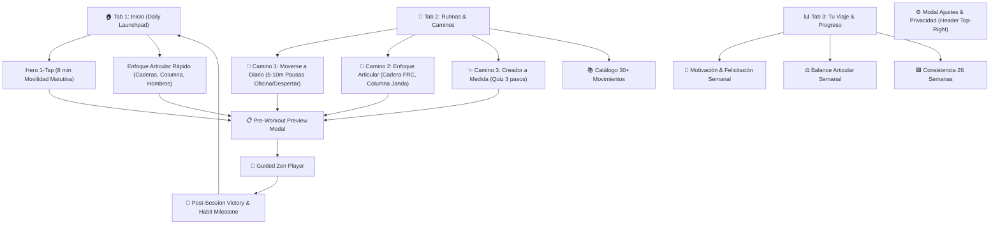

# 📱 Movilidad — Screen Flow & Architecture Map

> **Google Stitch Project**: `projects/17384172622607756718`
> **Aesthetic**: Quiet Vitality (Apple Minimalist + Sage Green #8DAA91 + Manrope Typography)

---

## 🧭 The 3 User Paths & Complete Screen Map

